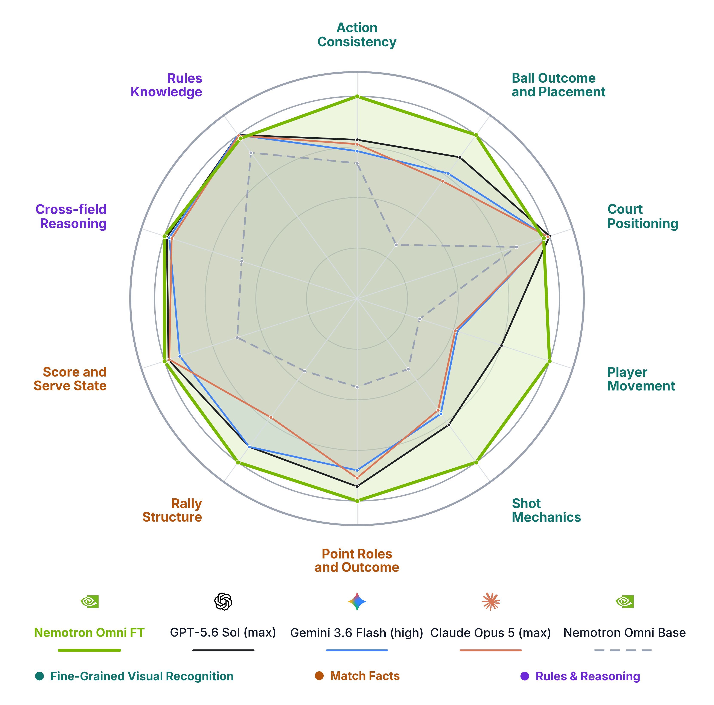
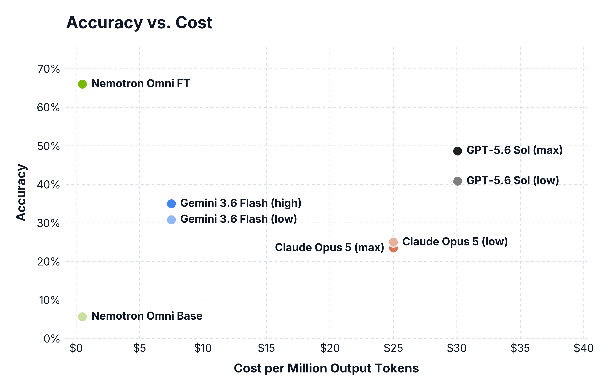
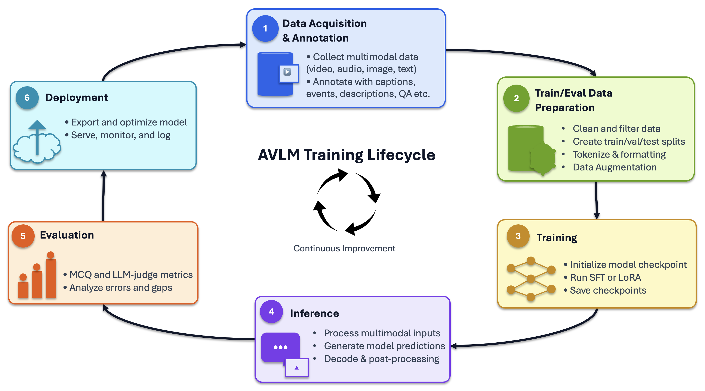
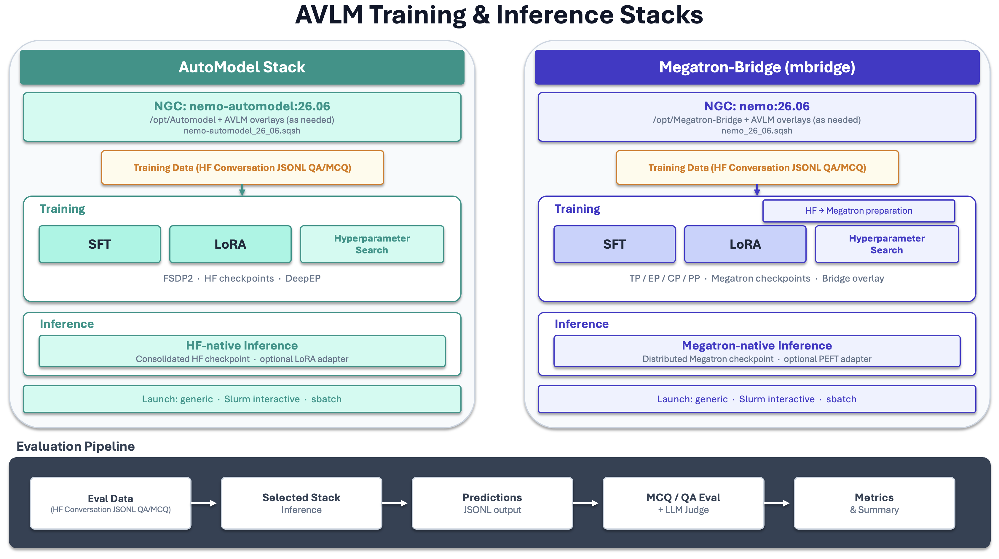

# NVIDIA Sports Intelligence Playbooks - AVLM

This repository provides a starter kit for sports-intelligence built on **NVIDIA AI stack**: playbooks, training recipes, and launch scripts using **Nemotron Multimodal Language Models**.

Public Nemotron Omni recipes cover generic fine-tuning; these playbooks are a sports-focused multimodal baseline with video/audio data, eval, and distributed train/infer workflows wired in. The training and inference scripts themselves are still generic enough to reuse for other multimodal applications beyond sports.

**What you get**

- End-to-end path: annotation → QA/MCQ data prep → SFT/LoRA → inference → evaluation
- Video+audio recipes with resolution and frame-sampling knobs suited to sports clips
- Measurable eval: per-class MCQ plus LLM-judge for open-ended answers
- Reproducible Slurm/generic launches, checkpoint conversion/parity, and inference→eval pipelines
- Side-by-side AutoModel vs Megatron-Bridge (SFT and LoRA)
- Practical notes from debugging and optimizing multimodal training for sports

**Docs:** [Sports Intelligence documentation](https://nvidia.github.io/sports-intelligence-playbooks/)

Accuracy spider plot across different evaluation aspects (for tennis). With fine-tuning, Nemotron Omni delivers consistently strong performance in visual recognition, match facts, and reasoning relative to frontier multimodal models.

<div align="center">
  
</div>

The following scatter plot shows the accuracy–cost comparison of the fine-tuned Nemotron Omni Model (30B) vs. other frontier (and much larger) multimodal models. With fine-tuning, Nemotron Omni achieves the highest accuracy at a fraction of the output-token cost of those frontier models.

<p align="center">
  
</p>

The playbooks cover one full AVLM round—from collecting and annotating multimodal sports data, through train/eval preparation, SFT/LoRA training, inference, and evaluation, with deployment as the next step. The repository layout below maps each stage to concrete scripts and guides; the two training stacks are interchangeable options for the training and inference steps.



Two training stacks:

- **[NeMo AutoModel](https://github.com/NVIDIA-NeMo/Automodel)** — full SFT and LoRA; generic (local) and Slurm launchers; container [`nemo-automodel:26.06.00`](https://catalog.ngc.nvidia.com/orgs/nvidia/-/containers/nemo-automodel/26.06.00).
- **[Megatron-Bridge](https://github.com/NVIDIA-NeMo/Megatron-Bridge)** — full SFT and LoRA; generic (local) and Slurm launchers; container [`nemo:26.06.00`](https://catalog.ngc.nvidia.com/orgs/nvidia/-/containers/nemo/26.06.00).

**AutoModel** trains on Hugging Face checkpoints and is the easier on-ramp for most users. **Megatron-Bridge** uses Megatron-format checkpoints and richer parallelism (after HF→Megatron conversion), which is better when you need that scale and control.

<br>



## Repository layout

<table>
  <thead>
    <tr>
      <th>Area</th>
      <th>Component</th>
      <th>Path</th>
    </tr>
  </thead>
  <tbody>
    <tr>
      <td><b>Data prep</b></td>
      <td><a href="avlm/data_prep_example/tennis/README.md">QA / MCQ generation</a></td>
      <td><code>avlm/data_prep_example/tennis/</code></td>
    </tr>
    <tr>
      <td rowspan="6"><b>Training</b></td>
      <td><a href="avlm/training/automodel/sft/SFT_GUIDE.MD">AutoModel SFT</a></td>
      <td><code>avlm/training/automodel/sft/</code> (<code>generic/</code> + <code>slurm/</code>)</td>
    </tr>
    <tr>
      <td><a href="avlm/training/automodel/lora/LORA_GUIDE.MD">AutoModel LoRA</a></td>
      <td><code>avlm/training/automodel/lora/</code> (<code>generic/</code> + <code>slurm/</code>)</td>
    </tr>
    <tr>
      <td><a href="avlm/training/megatron-bridge/sft/SFT_GUIDE.MD">Megatron-Bridge SFT</a></td>
      <td><code>avlm/training/megatron-bridge/sft/</code> (<code>generic/</code> + <code>slurm/</code>)</td>
    </tr>
    <tr>
      <td><a href="avlm/training/megatron-bridge/lora/LORA_GUIDE.MD">Megatron-Bridge LoRA</a></td>
      <td><code>avlm/training/megatron-bridge/lora/</code> (<code>generic/</code> + <code>slurm/</code>)</td>
    </tr>
    <tr>
      <td><a href="avlm/training/megatron-bridge/hf_megatron_conversion/MODEL_CONVERSION.MD">HF ↔ Megatron conversion</a></td>
      <td><code>avlm/training/megatron-bridge/hf_megatron_conversion/</code></td>
    </tr>
    <tr>
      <td><a href="avlm/training/hyperparam_search/README.MD">Hyperparameter search</a></td>
      <td><code>avlm/training/hyperparam_search/</code></td>
    </tr>
    <tr>
      <td rowspan="2"><b>Inference</b></td>
      <td><a href="avlm/inference/README.md#automodel">AutoModel</a></td>
      <td><code>avlm/inference/automodel/</code> (<code>configs/</code> + <code>slurm/</code>)</td>
    </tr>
    <tr>
      <td><a href="avlm/inference/README.md#megatron-bridge">Megatron-Bridge</a></td>
      <td><code>avlm/inference/megatron-bridge/</code> (<code>configs/</code> + <code>slurm/</code>)</td>
    </tr>
    <tr>
      <td rowspan="2"><b>Evaluation</b></td>
      <td><a href="avlm/evals/README.MD">MCQ eval</a></td>
      <td><code>avlm/evals/mcq/</code></td>
    </tr>
    <tr>
      <td><a href="avlm/evals/README.MD">LLM-judge eval</a></td>
      <td><code>avlm/evals/qa_llm_judge/</code></td>
    </tr>
    <tr>
      <td><b>Dependencies</b></td>
      <td><a href="wheels/deepep/DEEPEP.MD">DeepEP</a></td>
      <td><code>wheels/deepep/</code> (pre-Hopper / A100; post-Hopper ships in <code>nemo-automodel</code>)</td>
    </tr>
  </tbody>
</table>

## Getting started

Full walkthrough: [training setup](https://nvidia.github.io/sports-intelligence-playbooks/latest/multimodal/training/setup.html).

Clone this repo, `cd` to the root, and run launchers from there. Choose **one** stack under `avlm/training/` — AutoModel (HF checkpoints) or Megatron-Bridge (Megatron checkpoints + Bridge recipes).

### Containers

| Stack | NGC container |
|-------|---------------|
| AutoModel | [`nemo-automodel:26.06.00`](https://catalog.ngc.nvidia.com/orgs/nvidia/-/containers/nemo-automodel/26.06.00) |
| Megatron-Bridge | [`nemo:26.06.00`](https://catalog.ngc.nvidia.com/orgs/nvidia/-/containers/nemo/26.06.00) |

Pull and run with Docker (e.g. for local GPUs / `generic/` training):

```bash
# NeMo AutoModel
docker pull nvcr.io/nvidia/nemo-automodel:26.06.00
docker run --gpus all -it --rm \
  -v "$PWD":/workspace -w /workspace \
  nvcr.io/nvidia/nemo-automodel:26.06.00 bash

# NeMo Framework (Megatron-Bridge)
docker pull nvcr.io/nvidia/nemo:26.06.00
docker run --gpus all -it --rm \
  -v "$PWD":/workspace -w /workspace \
  nvcr.io/nvidia/nemo:26.06.00 bash
```

On Slurm clusters that use **enroot**, convert each NGC image once to a `.sqsh` squashfs file for job launches (no Docker daemon on compute nodes). Then set `CONTAINER_IMAGE` in `launch_local.yaml` to that `.sqsh` path:

```bash
# NeMo AutoModel
enroot import -o nemo-automodel_26_06.sqsh \
  docker://nvcr.io/nvidia/nemo-automodel:26.06.00

# NeMo Framework (Megatron-Bridge)
enroot import -o nemo_26_06_00.sqsh \
  docker://nvcr.io/nvidia/nemo:26.06.00
```

SFT and LoRA dirs share the same shape: `configs/` (recipe YAML), `generic/` (train when GPUs are already up), `slurm/` (interactive + `sbatch`). Copy `launch.yaml` → `launch_local.yaml`, then set `CONTAINER_IMAGE`, `CACHE_DIR`, and cluster fields. Framework code defaults to the container install (`/opt/Automodel` or `/opt/Megatron-Bridge`); optional git bootstrap is only for pinning a different upstream commit (see the stack guides).

### Suggested first path

1. Edit the recipe YAML (train/val JSONL paths and video root).
2. Smoke on **1 node × 8 GPUs** via `generic/` or Slurm interactive before multinode `sbatch`.
3. **AutoModel / DeepEP:** post-Hopper images already include DeepEP; on pre-Hopper (e.g. A100) the matching wheel under `wheels/deepep/` is installed automatically when the recipe uses `dispatcher: deepep`.

## License

All code in this repository is licensed under the [Apache License, Version 2.0](https://www.apache.org/licenses/LICENSE-2.0.txt) (Apache-2.0). See [LICENSE](LICENSE) for the full license text.
