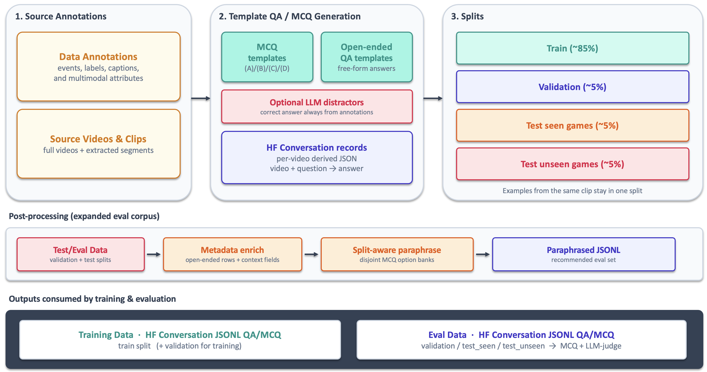

# Tennis Data-Prep Example

This example includes **sample raw annotation data from 2 tennis games** (20 points) in `raw_tennis_data_input/` and walks through how that data is converted into **HuggingFace conversation JSONL** for train / validation / test under `training_tennis_data_output/`. **Training videos are not included** — only the annotation JSON.

Templates under `configs/` turn the raw annotations into QA and MCQ examples
for training AVLMs. See the [legacy examples](TEMPLATE_EXAMPLES.MD)
and [categorical examples](categorical_evaluation/categorical_data_samples/TEMPLATE_EXAMPLES_CATEGORICAL.MD).
Most questions need no LLM; legacy `mcq_*` templates use one only to write incorrect distractors.

## Requirements

| Need | Packages |
|---|---|
| **Offline pipeline** (deterministic MCQ + open-ended QA) | Python 3.10+, `tqdm` |
| **`mcq_*` LLM distractors** | `openai`, `python-dotenv`; LLM API key in `dev_local.env` (copy from `dev.env`) |

Install Python dependencies in this directory with [uv](https://docs.astral.sh/uv/):

```bash
cd avlm/data_prep_example/tennis
uv sync && source .venv/bin/activate
```

## Quick start

Once the [Requirements](#requirements) above are satisfied:

```bash
cd avlm/data_prep_example/tennis
python prepare_training_data_pipeline.py
```

Output lands in `training_tennis_data_output/`; final splits are in `training_tennis_data_output/data_splits_hf/*.jsonl`.

## Pipeline



```
raw_tennis_data_input/<videoId>.json
      │  generate_mcq_qa.py   (templates in configs/)
      ▼
training_tennis_data_output/mcq_qa_per_video/<videoId>_derived_mcq_qa.json
      │  split_dataset.py     (point-level split)
      ▼
training_tennis_data_output/data_splits_hf/tennis_mcq_qa_{train,validation,test_seen_videos,test_unseen_videos}.jsonl
```

Each point becomes many training examples — one per question template.

## Categorical evaluation mode

The categorical pipeline generates 39 MCQ/QA templates across five evaluation
areas: visual recognition, commentary, match facts, rules/reasoning, and audio.
It uses explicit point annotations and requires no LLM with the current config.

Run it on the included annotations without checking for local video files:

```bash
python prepare_training_data_pipeline.py \
  --mode categorical \
  --input-dir raw_tennis_data_input \
  --output-dir training_tennis_data_output/categorical \
  --video-root ""
```

The output contains:

| Directory | Contents |
|---|---|
| `generated/` | HF JSONL splits + `per_video/` (canonical options; no metadata) |
| `with_metadata/` | Splits with open-ended evaluation metadata |
| `with_metadata_paraphrased/` | Metadata + split-specific MCQ paraphrases (**recommended**) |

Rules questions are selected from annotation triggers, capped at two per point,
and ask for the general tennis rule. See the
[categorical evaluation taxonomy](categorical_evaluation/CATEGORICAL_EVAL.MD)
and [tennis rules trigger map](categorical_evaluation/tennis_rules_trigger_map.md)
for details.

## How configs generate training data

Both generators walk every annotated point and apply named templates from
`configs/`: `generate_mcq_qa.py` uses the legacy MCQ/QA configs, while
`generate_categorical_mcq_qa.py` uses the categorical evaluation config.

| File | Role |
|---|---|
| `configs/generation/tennis_mcq_config.json` | Multiple-choice templates (`server_winner`, `how_point_ended`, `score_after`, …) |
| `configs/generation/tennis_qa_config.json` | Open-ended QA (`point_caption`, `how_point_ended_description`, `audio_cues`) |
| `configs/generation/tennis_categorical_eval_config.json` | Categorical MCQ/QA templates with super- and fine-category metadata |
| `configs/generation/question_types.json` | Optional allow-list of template names to generate (omit to generate all) |

Each template specifies:
- **`field`** — which point column supplies the ground-truth answer (e.g. `how_point_ended`)
- **`question`** — prompt text with placeholders (`<player1>`, `<score_before>`, …) filled from video metadata + point fields
- **`type`** — how to build the answer/options:
  - **categorical** — the template defines a fixed list of multiple-choice options in the config (for example, the four server/winner combinations, or the set of "how the point ended" categories). The generator reads the annotated field, picks the matching option as the correct answer, and presents the full predefined list as the MCQ choices.
  - **numeric_range** — the annotated field is a number (for example, `num_shots_exchanged`). The template maps numeric intervals to labeled answers (for example, 1 → "1 shot", 2 → "2 shots", 11–20 → "11–20 shots"). The generator finds which interval contains the annotated value and uses the corresponding label as the correct answer; the other interval labels are the distractors.
  - **open_ended** — assistant reply is the annotation field verbatim
  - **llm_gen_distractor** — MCQ where the correct option is still the annotated text, but three wrong options are written by an LLM (`mcq_*` templates only; needs `dev_local.env` API key)

For each point, the generator: (1) resolves placeholders, (2) picks the correct option from the annotated field, (3) shuffles distractors, (4) wraps everything in an HF `conversation` with the point's relative `video` path.

Restrict types (see [Requirements](#requirements)):

```bash
python prepare_training_data_pipeline.py \
  --question-types-config configs/generation/question_types.json
```

## Input format

`raw_tennis_data_input/<videoId>.json` — Data layout, one file per match:

```json
{
  "metadata": { "name": "...", "status": "..." },
  "instances": [
    { "className": "player_1_name", "attributes": [{ "name": "Jack Draper" }] },
    {
      "className": "table",
      "attributes": [{
        "name": [
          {
            "id": "6f7b9d82-...",
            "server": "Player 2",
            "receiver": "Player 1",
            "winner": "Server",
            "how_point_ended": "Unforced Error: ...",
            "point_caption": "Alcaraz delivers a well-placed serve...",
            "score_before": "0-0, 0-0",
            "score_after": "0-0, 0-15",
            "start_time": 13.08,
            "end_time": 19,
            "video": "sample_video_001/sample_video_001_seg_01_13_19_timeoffset_end_3.mp4"
          }
        ]
      }]
    }
  ]
}
```

## Output format

One JSON object per line in the split JSONL files. Each record is one (video, question) pair in HF conversation form. The `class` field carries the question-type / template name (e.g. `server_winner`, `score_after`) the record was generated from:

```json
{
  "id": "sample_video_001_ServerWinner_6f7b9d82-...",
  "class": "server_winner",
  "conversation": [
    {
      "role": "user",
      "content": [
        {"type": "video", "path": "sample_video_001/sample_video_001_seg_01_13_19_timeoffset_end_3.mp4"},
        {"type": "text", "text": "Who served and who won...?\n(A) ...\n(B) ...\n(C) ...\n(D) ..."}
      ]
    },
    {
      "role": "assistant",
      "content": [{"type": "text", "text": "(A) Carlos Alcaraz served and Carlos Alcaraz won"}]
    }
  ]
}
```

Open-ended QA omits the `(A)/(B)/...` options; the assistant text is the annotation field directly.

Splits: **train** / **validation** / **test_seen_videos** (seen match, held-out points) / **test_unseen_videos** (fully held-out match). All Q&A for a point stay in the same split.

## Example point annotation

One full point row from the `table` instance in `raw_tennis_data_input/sample_video_001.json` (Draper vs Alcaraz, first point):

```json
{
  "metadata": {},
  "id": "6f7b9d82-1744-47a2-afb9-91507d3c8a90",
  "start_time": 13.08,
  "end_time": 19,
  "point_start_in_segment": "Yes",
  "point_concluded_in_segment": "Yes",
  "server": "Player 2",
  "receiver": "Player 1",
  "winner": "Server",
  "num_serving_attempts_until_successful": "1",
  "num_shots_exchanged": "2",
  "score_before": "\"Draper vs. Alcaraz : {0-0, 0-0}\"",
  "score_after": "\"Draper vs. Alcaraz : {0-0, 0-15}\"",
  "how_point_ended": "Unforced Error: player makes a mistake during the point without significant pressure such as hitting the ball outside of the court (long or wide) or into the net during a routine shot. Routine miss without pressure.",
  "how_point_ended_description": "The point ended when Draper hit the ball into his own court with a forehand shot.",
  "point_caption": "Alcaraz delivers a well-placed serve, followed by Draper hitting the ball into his own court, conceding the point to Alcaraz. The crowd starts clapping after the point.",
  "audio_cues": "Whacks, squeaks, grunt, claps.",
  "qc_feedback": "",
  "rework_counter": 0,
  "timestamp_correct": "Yes",
  "audit_feedback": "",
  "comments_audit": "",
  "qc_pass_fail": 1,
  "audit_pass_fail": 1,
  "server_location": "Near-court",
  "receiver_location": "Far-court",
  "winner_shot_type": "n/a",
  "winner_shot_trajectory": "n/a",
  "winner_hand_used": "n/a",
  "loser_shot_type": "groundstroke with heavy topsin",
  "loser_shot_trajectory": "cross court",
  "loser_hand_used": "BH (backhand)",
  "loser_point_ended": "net",
  "loser_lateral_movement": "R2L (right to left)",
  "loser_depth_movement": "No depth movement",
  "video": "sample_video_001/sample_video_001_seg_01_13_19_timeoffset_end_3.mp4"
}
```

## Template examples

- [Legacy/default examples](TEMPLATE_EXAMPLES.MD)
- [Categorical examples](categorical_evaluation/categorical_data_samples/TEMPLATE_EXAMPLES_CATEGORICAL.MD)

## Sample data

| Video | Match | Points | Split role (seed 42) |
|---|---|---|---|
| `sample_video_001` | Draper vs Alcaraz | 10 | seen → train / val / test_seen |
| `sample_video_002` | Federer vs Benneteau | 10 | held out → test_unseen |
