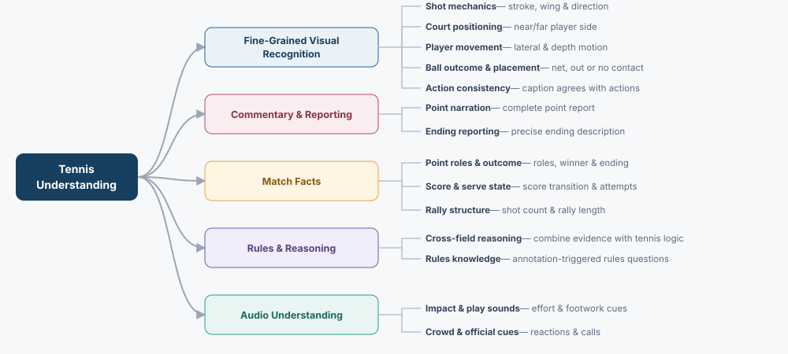
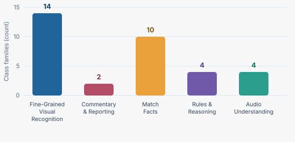
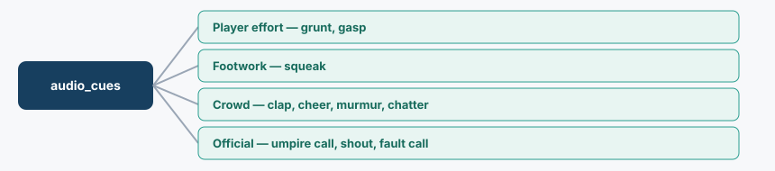

# Tennis Categorical Evaluation

This document organizes tennis-understanding evaluation tasks supported by our current point annotation data (data factory). It excludes evaluating on any dimension requiring new labels, such as player pose/form, frame-level ball tracking, sweet-spot versus mis-hit audio, and commentary transcription.

**Research alignment:** the five super categories correspond to common sports multimodal evaluation themes—fine-grained visual recognition, captioning/reporting, match facts, rules and logical reasoning, and audio understanding—while their specific tasks remain constrained by our available annotations.

| Framework summary | Count |
|---|---:|
| Super categories | **5** |
| Fine categories | **14** |
| Class families | **34** |
| Configured templates | **39** (37 MCQ, 2 QA) |

## Category hierarchy



*The hierarchy groups each MCQ/QA class into exactly one fine category and one of five broad tennis-understanding capabilities.*

## Class families



*The graph shows the number of MCQ/QA class families assigned to each super category.*

## Fine-category glossary

<table>
  <thead>
    <tr><th>Super category</th><th>Fine category</th><th>Meaning</th><th>Example</th></tr>
  </thead>
  <tbody>
    <tr>
      <td rowspan="5"><strong>Fine-Grained Visual Recognition</strong></td>
      <td>Shot Mechanics</td>
      <td>Recognizing the stroke type, forehand/backhand wing, and shot direction used at the end of a point.</td>
      <td>A forehand topspin groundstroke travels cross-court.</td>
    </tr>
    <tr>
      <td>Court Positioning</td>
      <td>Identifying whether the server and receiver occupy the near or far side of the visible court.</td>
      <td>The server is on the near court and the receiver is on the far court.</td>
    </tr>
    <tr>
      <td>Player Movement</td>
      <td>Recognizing lateral and depth movement during the annotated point-ending action.</td>
      <td>The losing player moves right-to-left without changing court depth.</td>
    </tr>
    <tr>
      <td>Ball Outcome and Placement</td>
      <td>Determining whether the final ball went into the net, landed out, or was not contacted.</td>
      <td>The final return goes into the net.</td>
    </tr>
    <tr>
      <td>Action Consistency</td>
      <td>Selecting a caption whose action agrees with verified shot and movement fields. If the caption omits a structured action, that verified value is injected into the correct option before distractors alter it.</td>
      <td>Reject “backhand cross-court” when the verified action is “forehand down the line.”</td>
    </tr>
    <tr>
      <td rowspan="2"><strong>Commentary &amp; Reporting</strong></td>
      <td>Point Narration</td>
      <td>Producing a grounded account of the complete point.</td>
      <td>The server faults, succeeds on the second serve, and wins after the receiver hits into the net.</td>
    </tr>
    <tr>
      <td>Ending Reporting</td>
      <td>Producing a precise description of how the point ended.</td>
      <td>The receiver hits a backhand beyond the baseline to concede the point.</td>
    </tr>
    <tr>
      <td rowspan="3"><strong>Match Facts</strong></td>
      <td>Point Roles and Outcome</td>
      <td>Reading the server, receiver, point winner, winner role, and annotated ending outcome.</td>
      <td>The receiver wins after the server commits an unforced error.</td>
    </tr>
    <tr>
      <td>Score and Serve State</td>
      <td>Reading the score before and after the point, its transition, and the number of serve attempts.</td>
      <td>The score moves from 30–15 to 40–15 after two serve attempts.</td>
    </tr>
    <tr>
      <td>Rally Structure</td>
      <td>Describing the temporal shape of the point through shot count and rally-length groupings.</td>
      <td>A 14-shot exchange is categorized as a long rally.</td>
    </tr>
    <tr>
      <td rowspan="2"><strong>Rules &amp; Reasoning</strong></td>
      <td>Cross-field Reasoning</td>
      <td>Combining multiple annotations and tennis logic to answer a question that no single provided field resolves.</td>
      <td>Two failed serve attempts with a double-fault outcome jointly explain the point.</td>
    </tr>
    <tr>
      <td>Rules Knowledge</td>
      <td>Answering point-level tennis-rules questions selected by annotation triggers.</td>
      <td>Two failed serves result in a double fault.</td>
    </tr>
    <tr>
      <td rowspan="2"><strong>Audio Understanding</strong></td>
      <td>Impact and Play Sounds</td>
      <td>Recognizing player-effort and court-movement sounds during play.</td>
      <td>Shoe squeaks and a player grunt are audible.</td>
    </tr>
    <tr>
      <td>Crowd and Official Cues</td>
      <td>Recognizing crowd reactions and audible umpire or fault calls.</td>
      <td>An umpire fault call is followed by crowd clapping.</td>
    </tr>
  </tbody>
</table>

## Category summary

| Super category | Fine categories | Primary raw fields | Evaluation focus |
|---|---|---|---|
| Fine-Grained Visual Recognition | Shot Mechanics; Court Positioning; Player Movement; Ball Outcome and Placement; Action Consistency | `winner_*`, `loser_*`, `server_location`, `receiver_location`, `point_caption` | Recognize visual attributes and select captions consistent with them |
| Commentary & Reporting | Point Narration; Ending Reporting | `point_caption`, `how_point_ended_description` | Produce grounded point-level reports |
| Match Facts | Point Roles and Outcome; Score and Serve State; Rally Structure | `server`, `receiver`, `winner`, `how_point_ended`, scores, serve attempts, shot count | Read or directly combine annotated point state |
| Rules & Reasoning | Cross-field Reasoning; Rules Knowledge | Structured point fields (serve attempts, roles, outcome, score, shot count); annotation-triggered rules MCQs | Apply tennis logic, integrate evidence across fields, and answer point-level rules questions when the clip situation matches |
| Audio Understanding | Impact and Play Sounds; Crowd and Official Cues | `audio_cues` | Recognize normalized audible-event presence |

**Cross-cutting evaluation protocol:** modality ablation re-evaluates the same classes with video-only, audio-only, and audio-video inputs. It is not counted as a class family or content category.

The generator loads all configured templates unless `question_types` filters them. Missing values, `n/a`, inconsistent annotations, and insufficient MCQ options are skipped. The four additional shot/trajectory templates are sampled “none of the other options” variants; `rules_knowledge_contextual_secondary` shares the `rules_knowledge_contextual` class.

## 1. Fine-Grained Visual Recognition

Complete-corpus statistics are reported in `categorical_data_samples/TEMPLATE_EXAMPLES_CATEGORICAL.MD`. Eligibility varies by annotation: winner-side shot fields are naturally unavailable when the point ends on an error or fault, while loser-side shot/movement and player-location fields cover a larger share of the corpus. Near/far court assignments are not constant in the complete corpus; their imbalance and all other class distributions should be considered when constructing evaluation splits.

<table>
  <thead><tr><th>Fine category</th><th>MCQ/QA class type</th><th>Format</th><th>Ground-truth field(s)</th><th>Example question</th></tr></thead>
  <tbody>
    <tr><td rowspan="6"><strong>Shot Mechanics</strong></td><td><code>winner_shot_type</code></td><td>MCQ</td><td><code>winner_shot_type</code></td><td>What type of shot did the winning player hit to win the point?</td></tr>
    <tr><td><code>loser_shot_type</code></td><td>MCQ</td><td><code>loser_shot_type</code></td><td>What type of shot did the losing player hit at the end of the point?</td></tr>
    <tr><td><code>winner_hand_used</code></td><td>MCQ</td><td><code>winner_hand_used</code></td><td>What stroke side did the winning player use on the point-winning shot?</td></tr>
    <tr><td><code>loser_hand_used</code></td><td>MCQ</td><td><code>loser_hand_used</code></td><td>What stroke side did the losing player use on the final shot?</td></tr>
    <tr><td><code>winner_shot_trajectory</code></td><td>MCQ</td><td><code>winner_shot_trajectory</code></td><td>What was the winning shot's direction?</td></tr>
    <tr><td><code>loser_shot_trajectory</code></td><td>MCQ</td><td><code>loser_shot_trajectory</code></td><td>What was the losing player's final-shot direction?</td></tr>
    <tr><td rowspan="3"><strong>Court Positioning</strong></td><td><code>server_location</code></td><td>MCQ</td><td><code>server_location</code></td><td>Was the server on the near or far side of the court?</td></tr>
    <tr><td><code>receiver_location</code></td><td>MCQ</td><td><code>receiver_location</code></td><td>Was the receiver on the near or far side of the court?</td></tr>
    <tr><td><code>server_receiver_location</code></td><td>MCQ</td><td><code>server_location</code>, <code>receiver_location</code></td><td>Which option identifies the server and receiver court sides?</td></tr>
    <tr><td rowspan="3"><strong>Player Movement</strong></td><td><code>loser_lateral_movement</code></td><td>MCQ</td><td><code>loser_lateral_movement</code></td><td>What was the losing player's lateral movement?</td></tr>
    <tr><td><code>loser_depth_movement</code></td><td>MCQ</td><td><code>loser_depth_movement</code></td><td>How did the losing player move forward or backward?</td></tr>
    <tr><td><code>loser_combined_movement</code></td><td>MCQ</td><td>Lateral and depth movement</td><td>Which description best matches the losing player's movement?</td></tr>
    <tr><td><strong>Ball Outcome and Placement</strong></td><td><code>loser_point_ended</code></td><td>MCQ</td><td><code>loser_point_ended</code></td><td>How did the point end for the losing player?</td></tr>
    <tr><td><strong>Action Consistency</strong></td><td><code>mcq_caption_action_mismatch</code></td><td>MCQ</td><td>Caption + shot/movement fields</td><td>What happened in this point?</td></tr>
  </tbody>
</table>

## 2. Commentary & Reporting

<table>
  <thead><tr><th>Fine category</th><th>MCQ/QA class type</th><th>Format</th><th>Ground-truth field(s)</th><th>Example question</th></tr></thead>
  <tbody>
    <tr><td><strong>Point Narration</strong></td><td><code>point_caption</code></td><td>QA</td><td><code>point_caption</code></td><td>What happened in this point? Provide a detailed caption.</td></tr>
    <tr><td><strong>Ending Reporting</strong></td><td><code>how_point_ended_description</code></td><td>QA</td><td><code>how_point_ended_description</code></td><td>Describe how this point ended.</td></tr>
  </tbody>
</table>

## 3. Match Facts

<table>
  <thead><tr><th>Fine category</th><th>MCQ/QA class type</th><th>Format</th><th>Ground-truth field(s)</th><th>Example question</th></tr></thead>
  <tbody>
    <tr><td rowspan="4"><strong>Point Roles and Outcome</strong></td><td><code>server_winner</code></td><td>MCQ</td><td><code>server</code>, <code>winner</code></td><td>Who served and who won the point?</td></tr>
    <tr><td><code>receiver_winner</code></td><td>MCQ</td><td><code>receiver</code>, <code>winner</code></td><td>Who received and who won the point?</td></tr>
    <tr><td><code>how_point_ended</code></td><td>MCQ</td><td><code>how_point_ended</code></td><td>How did this point end?</td></tr>
    <tr><td><code>winner_role</code></td><td>MCQ</td><td><code>winner</code></td><td>Did the server or receiver win?</td></tr>
    <tr><td rowspan="4"><strong>Score and Serve State</strong></td><td><code>score_after</code></td><td>MCQ</td><td><code>score_before</code>, <code>score_after</code></td><td>What was the score after this point?</td></tr>
    <tr><td><code>num_serving_attempts_until_successful</code></td><td>MCQ</td><td>Serve-attempt count</td><td>How many serving attempts were made?</td></tr>
    <tr><td><code>score_transition</code></td><td>MCQ</td><td>Scores, winner, server, receiver</td><td>Who won and what was the new score?</td></tr>
    <tr><td><code>serve_sequence_outcome</code></td><td>MCQ</td><td>Serve attempts, outcome</td><td>Which serve sequence and outcome describe this point?</td></tr>
    <tr><td rowspan="2"><strong>Rally Structure</strong></td><td><code>num_shots_exchanged</code></td><td>MCQ</td><td><code>num_shots_exchanged</code></td><td>How many shots were exchanged?</td></tr>
    <tr><td><code>rally_length_bucket</code></td><td>MCQ</td><td><code>num_shots_exchanged</code></td><td>How long was this rally?</td></tr>
  </tbody>
</table>

## 4. Rules & Reasoning

The serve-rule probe asks which option is consistent with tennis rules and the
video and uses contradictory distractors. The grounded variant adds one
coherent but video-incorrect scenario, so the clip is required to distinguish
the two rule-consistent options. Point-outcome reasoning uses the winning role
and ending mechanism to explain why that role won.

**Rules Knowledge** asks closed-vocab point-level rules MCQs only when the
annotation situation matches a trigger (ace, double fault, deuce/ad, break
point, ball into net/out, etc.). Candidate questions live in
`configs/rules/tennis_rules_question_bank.json`; triggers in
`configs/rules/tennis_rules_trigger_map.json` (and
`tennis_rules_trigger_map.md`). Up to two matching questions are emitted per
point. Stems/options are paraphrased post-split via
`configs/paraphrases/rules_knowledge_paraphrase_bank.json`.

<table>
  <thead><tr><th>Fine category</th><th>MCQ/QA class type</th><th>Format</th><th>Ground-truth field(s)</th><th>Example question</th></tr></thead>
  <tbody>
    <tr><td rowspan="3"><strong>Cross-field Reasoning</strong></td><td><code>serve_rule_consistency</code></td><td>MCQ</td><td>Serve attempts, outcome, rules</td><td>Which option is consistent with tennis rules and the video?</td></tr>
    <tr><td><code>grounded_serve_rule_consistency</code></td><td>MCQ</td><td>Video, serve attempts, outcome, rules</td><td>Which option also matches this point?</td></tr>
    <tr><td><code>point_outcome_reasoning</code></td><td>MCQ</td><td>Winning role, ending outcome</td><td>Why did the server or receiver win?</td></tr>
    <tr><td><strong>Rules Knowledge</strong></td><td><code>rules_knowledge_contextual</code></td><td>MCQ</td><td>Annotation triggers → rules bank</td><td>What results from two serve faults?</td></tr>
  </tbody>
</table>

## 5. Audio Understanding

The `audio_cues` annotation is free text. Four presence classes normalize cues conservatively into player-effort, footwork, crowd, and official groups.

<table>
  <thead><tr><th>Fine category</th><th>MCQ/QA class type</th><th>Format</th><th>Ground-truth field(s)</th><th>Example question</th></tr></thead>
  <tbody>
    <tr><td rowspan="2"><strong>Impact and Play Sounds</strong></td><td><code>player_effort_sound_present</code></td><td>Yes/No MCQ</td><td>Grunt/gasp cues</td><td>Is a player effort sound audible?</td></tr>
    <tr><td><code>court_movement_sound_present</code></td><td>Yes/No MCQ</td><td>Squeak cues</td><td>Are shoe squeaks audible?</td></tr>
    <tr><td rowspan="2"><strong>Crowd and Official Cues</strong></td><td><code>crowd_reaction_present</code></td><td>Yes/No MCQ</td><td>Clap/cheer/gasp/murmur cues</td><td>Is there an audible crowd reaction?</td></tr>
    <tr><td><code>official_call_present</code></td><td>Yes/No MCQ</td><td>Umpire/fault-call cues</td><td>Is an umpire or fault call audible?</td></tr>
  </tbody>
</table>

Audio cue normalization:



*The graph shows the four conservative audio groups used by the current presence templates. Generic ball-impact cues remain annotated but are not an evaluation class.*

**Sweet-spot versus mis-hit audio:** a sweet-spot hit is clean racket-ball contact near the center of the string bed, typically producing a solid pop or thwack. A mis-hit is off-center contact—such as near the frame, tip, or edge—and may sound thinner or more muted. The current annotations record generic impact cues such as `pop`, `thwack`, and `smack`, but do not explicitly label contact quality. Therefore, this distinction is informative but excluded from the current evaluation plan because it requires new annotation.

## Data generation stages

Regenerate the categorical dataset (no LLM call required with the current config) from `avlm/data_prep_example/tennis/`:

```bash
python prepare_training_data_pipeline.py \
  --mode categorical \
  --input-dir aggregated_data_complete \
  --output-dir ../../data/categorical_data_v2 \
  --max-workers 8
```

That writes three named directories under `--output-dir` (for example `avlm/data/categorical_data_v2/`):

| Directory | Contents |
|---|---|
| `generated/` | Original HF JSONL splits + `per_video/` (canonical option text; no metadata) |
| `with_metadata/` | Copy of generated splits with point-level `metadata` on open-ended questions only |
| `with_metadata_paraphrased/` | Copy of `with_metadata/` after split-aware MCQ option paraphrasing |

Use **`with_metadata_paraphrased/`** for training and evaluation. Banks live
under `configs/paraphrases/` and are applied by
`paraphrase_serve_rule_options.py` after the split so train / validation /
test use disjoint paraphrase pools.

**Why paraphrase:** several closed-vocab reasoning templates reuse a tiny set of option strings (and often a fixed correct answer per option-set) across train, validation, and test. Without rewriting, a model can memorize surface forms—“whenever these four phrasings appear, pick B”—instead of using the video or tennis rules. Split-aware paraphrasing keeps the same meaning and option roles, but gives each split its own wording pool so that shortcut cannot transfer from train to eval. For `*_none` templates the correct label is always the none-phrase, so only that phrase is paraphrased (distractor shot/trajectory labels stay shared with the non-none templates).

## Data-quality gates

1. Skip missing values and literal `n/a` for field-specific questions.
2. Build option vocabularies from the full raw corpus, not only the two-match example.
3. Normalize spelling variants such as `topspin`/`topsin`, singular/plural audio cues, and capitalization.
4. Do not turn free-text inference into ground truth unless the information is explicit in the annotation.
5. Verify that each source caption agrees with its structured fields before generating contradiction questions.
6. Change exactly one verified fact in each controlled mismatch distractor.
7. Generate location and action mismatches only when the corresponding explicit fields are present and not `n/a`.
8. Do not treat a detail omitted from a caption as false or contradictory.
9. Report per-class support and imbalance before enabling a class.
10. Keep all examples from one point in the same split to prevent leakage.
11. After splitting, paraphrase closed-vocab reasoning templates (`serve_rule_consistency`, `grounded_serve_rule_consistency`, `serve_sequence_outcome`, `point_outcome_reasoning`) and the none-phrase on `*_none` shot/trajectory templates with disjoint train (8) / validation (3) / test (3) option banks so models cannot exploit shared surface forms across splits. Persist results under `with_metadata_paraphrased/` (`paraphrase_serve_rule_options.py`).
12. Report results at all three levels: super category, fine category, and MCQ/QA class.
