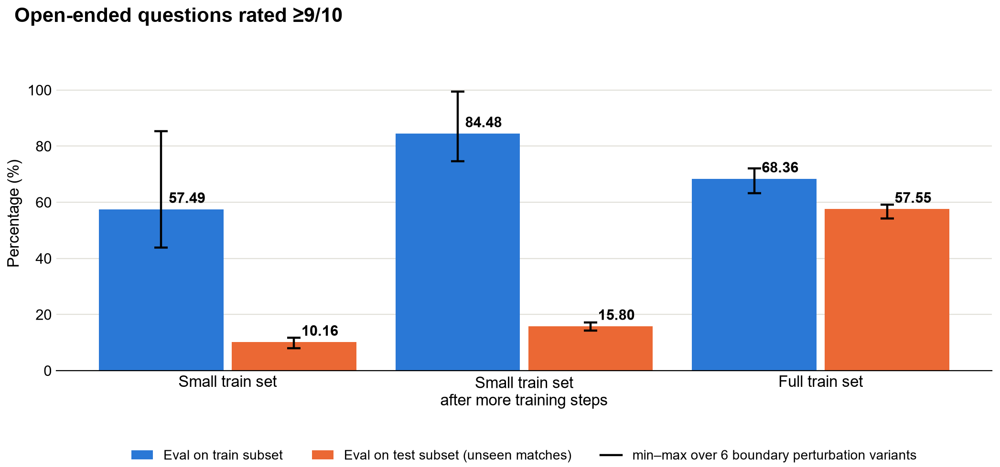
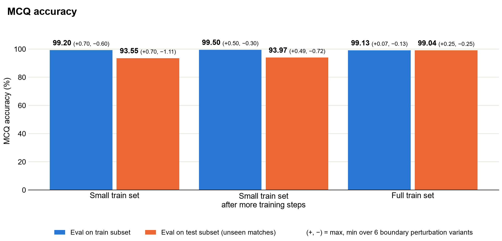

Small Training Datasets Amplify Boundary Sensitivity
============================================================

Long sports videos typically need to be divided into shorter temporal chunks before a multimodal model can process them. Those chunks may be produced by uniform, overlapping, or event-based segmentation. The temporal segmentation isn't always perfectly aligned with every event. Shifting a chunk’s start or end can cause the model to sample a different set of frames, even though the underlying sequence of actions remains the same.

**If the fine-tuning dataset is not large and varied enough, expect inconsistent predictions under these boundary shifts.** With limited examples, the model can become overly dependent on the temporal alignment seen during training. Broader training data exposes the model to more variation in action timing, surrounding context, and clip boundaries, reducing unexpected sensitivity at inference. The practical impact still depends on the task.

Expectations
------------

When possible, fine-tune with broader video coverage and more samples. This generally improves performance on held-out test videos from unseen matches and reduces sensitivity to the exact video temporal boundaries used to extract training video clips. However, the amount of data needed and the effect of a boundary shift depend on the difficulty and format of the target questions.

- **A small training set can be a practical starting point for constrained questions.** Expect some boundary sensitivity, but the impact may remain modest when the answer space is constrained and the task is already close to saturation.
- **Plan for a larger and more varied dataset for open-ended questions.** These questions require the model to ground and combine more visual evidence. With a small training set, expect larger response variance even under slight video temporal boundary perturbations, as well as weaker generalization to held-out test videos from unseen matches.

Evidence from Our Tests
-----------------------

- **Data scale.** In our test bench we used clips from 21 tennis matches (~1,600 question-answer samples) for our small-data experiment case and clips from 238 matches (~351,000 question-answer samples) for our large-data case.
- **Fine-tuning and evaluation.** We compared models trained on the small and large datasets. Evaluation covered the small set used for training and approximately 1,600 held-out examples from held-out test videos from unseen matches. Both MCQ and open-ended QA had reference answers: MCQ predictions were compared directly with the ground truth, while open-ended answers were evaluated with LLM-as-Judge using GPT-5.1.
- **Boundary test.** Training examples retained their annotated clip boundaries. At inference, we evaluated the original boundaries and five point boundary perturbations that shifted the start and/or end by approximately 1 second. In the charts, bars are averaged across the six conditions.

The training size impact varies for different question types. Open-ended QA generalized poorly to held-out test videos from unseen matches and showed a large relative spread under boundary shifts; full-data runs were substantially stronger and more stable. MCQ stayed in the low-to-mid 90% range with the small set, compared with the high 90% range for the full set, and its boundary-related variation was much smaller because the constrained task was already close to saturation.

   Percentage of open-ended questions rated >=9/10 by an LLM judge. The bar represents the mean percentage for 6 boundary perturbation timestamp variants. Small-data checkpoints remain weak on test and boundary-sensitive, while the full-data reference is substantially stronger.

   MCQ accuracy. The bar represents the mean accuracy for 6 boundary perturbation timestamp variants. The small-data training loses a few accuracy points relative to the full-data reference, but remains much less sensitive than open-ended QA.
