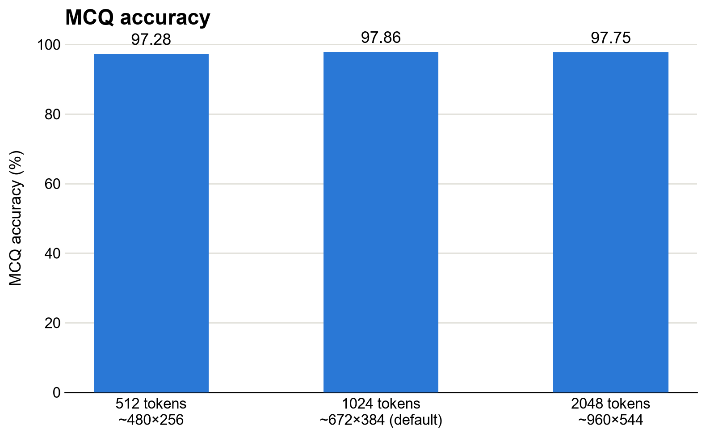
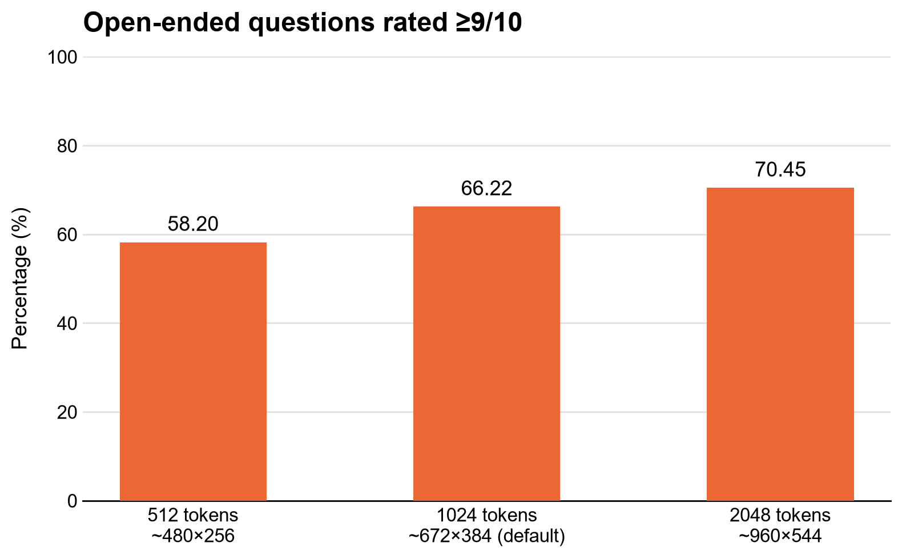

Effective Resolution's Impact on Prediction Accuracy
====================================================

**Effective input resolution can change model quality, but the impact is case by case.** Effective resolution is the spatial visual-token budget used to encode each frame, not simply the source video’s pixel dimensions.

Expectations
------------

The value of higher resolution depends on visual difficulty. More visual tokens can help when the model must resolve evidence that is ambiguous or easily lost at lower resolution, especially for open-ended questions. They may add little when the task is coarse or the benchmark is already saturated.

- **Expect larger gains for open-ended questions and visually demanding cases.** Higher-resolution runs can produce substantially better open-ended answers. Cases most likely to benefit include identifying athletes from small or ambiguous cues; resolving fine-grained details such as object position, player contact, line or boundary placement, action type, and outcome; and answering questions that require several visual facts to be combined. Longer answers may indicate this multi-fact requirement, but response length itself is not the reason to use higher resolution.
- **The gains could be less evident for coarse or constrained questions.** These tasks can saturate at lower resolution when they require little fine visual evidence, leaving limited room for additional visual tokens to improve accuracy. Fine-grained constrained questions may still benefit, so validate against the visual difficulty of your own questions.
- **Choose the lowest resolution that meets the quality target.** Additional visual tokens increase memory and compute requirements. Constrained questions that are already saturated, or questions that depend less on fine visual detail, may not justify the extra cost. Test low, default, and high settings on representative held-out cases from your own use case before selecting the resolution.

Evidence from Our Tests
-----------------------

In our experiments, higher resolution clearly helped the more challenging open-ended QA, while coarse MCQ remained near its performance ceiling.

- **Resolution settings.** We compared runs with 512, 1,024, and 2,048 visual tokens per frame, corresponding to effective resolutions of approximately 480x256, 672x384 (the default), and 960x544.
- **Controlled training.** The mixed MCQ/QA comparison used the same full training split, frame sampling (2 fps & up to 128 frames), and SFT recipe for all three settings. The runs used video without audio, and the vision encoder remained frozen so the comparison isolated the input-resolution setting.
- **Evaluation.** We evaluated checkpoints on held-out test videos from unseen matches. The chart reports the best checkpoint at each resolution, using MCQ accuracy and the share of open-ended answers receiving an LLM-judge score of at least 9 out of 10. A separate coarse action-classification benchmark approached 100% at all three resolutions, providing a ceiling check.

The effect is separated cleanly by task difficulty. MCQ differed by only 0.58 percentage points across the three settings and therefore did not discriminate resolution. Open-ended QA improved monotonically from 512 to 1,024 to 2,048 tokens at every evaluated checkpoint; the best 2,048-token result was 12.25 points above the 512-token result.

   MCQ accuracy evaluated on the held-out test videos from unseen matches. The accuracy remains near the ceiling across the three settings.

   Open-ended questions rated >=9/10. Percentage improves as effective resolution increases.

A follow-up analysis compared where the 2,048-token model improved most over the 512-token model. The largest differences clustered around three patterns: player identification when visual cues were ambiguous, fine-grained details such as shot type, placement, and outcome, and longer answers. The answer-length pattern likely reflects questions that require several visual facts to correctly answer the question. These patterns were manually spot-checked on a small number of examples, so treat them as hypotheses to validate for your own use case rather than universal guarantees.
