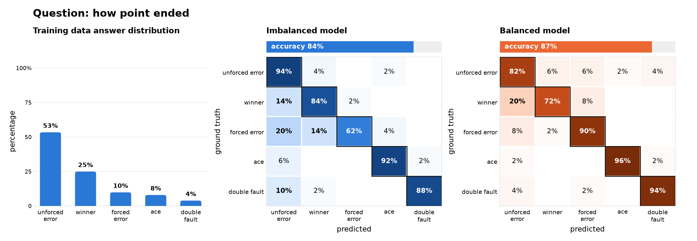

Training Data Bias Shapes Prediction Bias
==========================================

The performance of audio-visual language models (AVLMs) is shaped not only by the scale and quality of their training data, but also by the underlying distribution of training examples across modalities and semantic content. **A model fine-tuned on the training data with a biased distribution can learn label frequency as a shortcut.** It may overpredict frequent labels, miss rare ones even when the relevant evidence is present, and degrade when the deployment distribution differs from training.

Expectations
------------

- **Expect biased predictions when the training labels are biased.** Frequent labels can dominate the learning signal, pulling responses toward the training data distribution and the labels seen most often during training. More model capacity can be allocated to the dominant modes of the training data distribution. Aggregate accuracy can hide inaccuracies when the model is deployed under a different test distribution. This bias is best identified through rigorous evaluation on a balanced held-out test set.
- **Be aware of where sports data skews.** Some events are simply rare, such as a double fault or a blocked shot. Broadcast and annotation practices may also contribute to this imbalance, favoring highlights such as dunks, home runs, and stoppage-time goals over routine plays, as well as star teams and players over others.
- **Rebalance the training data to mitigate prediction bias.** Biases in the training data can affect the model’s internal representations and lead to biased predictions after fine-tuning. For example, in the case of multiple-choice questions (MCQs), resampling answer options more evenly gives underrepresented labels a stronger and more consistent learning signal.
- **Video clip length imbalance can bias AVLM training toward the temporal characteristics that are most common in the dataset.** If short clips dominate, the model may rely more heavily on localized visual and audio cues and receive less supervision for long-range temporal dependencies. Conversely, overrepresenting long clips can increase training cost and dilute supervision for brief, salient events. Balancing clip lengths can therefore improve coverage of both short- and long-range temporal patterns and promote more robust performance across videos of varying duration.

Evidence from Our Tests
-----------------------

In our experiments, prediction bias appeared when the training answer distribution was skewed. Rebalancing this distribution reduced the bias and distributed the model’s capacity more evenly across different answers.

- **Controlled training.** We fine-tuned two models on subsets drawn from the same MCQ training data, holding the subset size and training length constant:

  - **Imbalanced model:** Trained on a subset that follows the training data’s imbalanced answer distribution.
  - **Balanced model:** Trained on a subset resampled to have a uniform distribution across answer options.

- **Evaluation.** We evaluated both models on a class-balanced subset of held-out test videos from unseen matches.

The figure shows the source training data’s answer distribution, along with the confusion matrices of both models, where the first model is trained on a similarly distributed subset and the second model is trained on a balanced subset. Matrix rows represent ground-truth options, and columns represent predicted options; each row sums to 100%.

The first model was overwhelmed by the dominant option (“Unforced Error”) during training and concentrated its capacity on predicting that class correctly, leaving the minority classes underrepresented and weakly learned. Rebalancing the training data shifts attention away from the dominant class and distributes the model’s capacity more evenly across classes.

   **Left:** Distribution of ground-truth answers for “How Point Ended” in the source training data, **Middle:** Confusion matrix for the model trained on a subset following the source training data distribution, **Right:** Confusion matrix for the model trained on a balanced subset.
