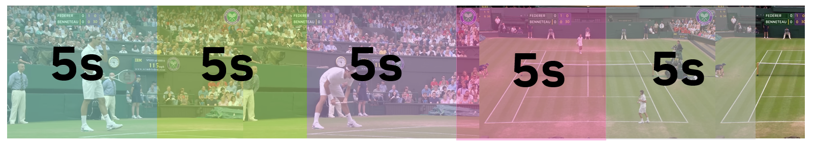
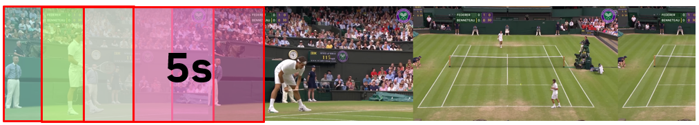
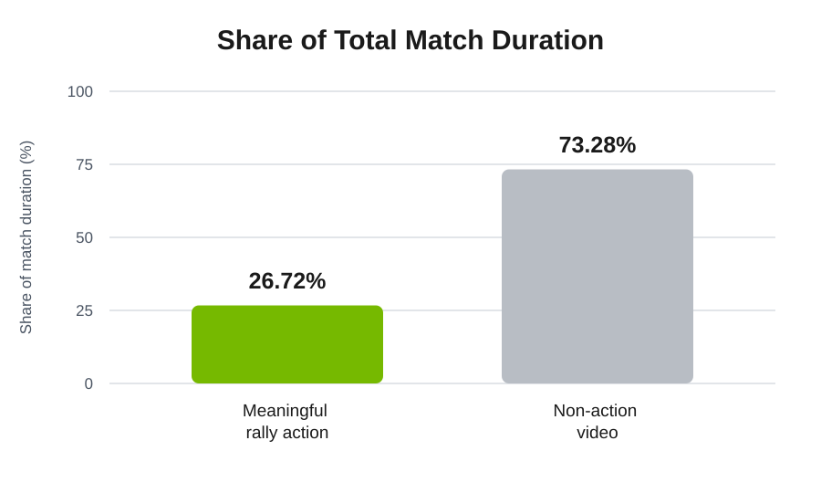
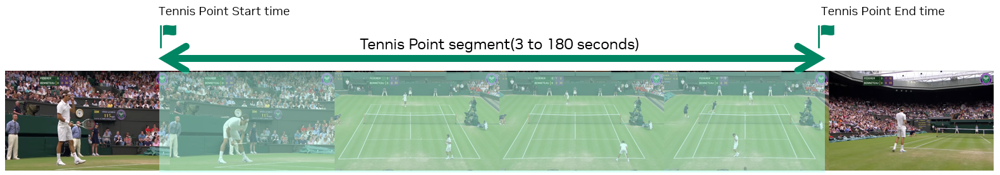

Prefer Event-Based Video Chunking
=================================

A full sports game can run for several hours, and processing such long videos in a single pass is impractical given the memory and compute constraints of even modern GPUs. Processing every frame is therefore infeasible. Chunking divides a long video into manageable training and inference inputs, allowing the pipeline to control temporal coverage and computate and memory cost. Recent work, such as `StreamingVLM <https://arxiv.org/abs/2510.09608>`_, processes arbitrarily long videos by intelligently evicting older KV-cache tokens, but still assumes uniform chunking.

**Chunking is not neutral:** the chosen boundaries determine how much meaningful action the model sees, whether an event is split across inputs, or how much redundant video must be processed. Improper chunking can hurt model understanding. For example, splitting a coherent event across chunks can remove important context, while an excessively long chunking window can include redundant content that wastes computation or memory and distracts the model. We can chunk a long video in three ways: (1) uniform chunks without overlap, (2) uniform chunks with overlap, and (3) event-based chunks.

Expectations
------------

- **Uniform chunking without overlap is simple but can split meaningful events.** Fixed windows cover the video once and keep computation predictable. However, their boundaries are unrelated to the action, so an event may be divided across chunks. When meaningful action is sparse within a long video, many chunks may contain mostly setup, downtime, or other low-value content. The window size also presents a direct tradeoff: windows that are too long waste memory and compute and overwhelm the model with irrelevant content, while windows that are too short may omit the context needed to understand an event.

   Uniform chunking without overlap. Fixed windows cover the video once, but an event can be split at a window boundary.

- **Uniform chunking with overlap reduces chunk boundary misses at a higher cost.** Overlap gives events near a window boundary another chance to appear with sufficient context. The tradeoff is repeated frames and duplicated non-action content, which increase inference costs across long videos.

   Uniform chunking with overlap. Repeated coverage protects boundary context but processes some frames more than once.

- **Prefer event-based chunking when reliable event boundaries are available, or achievable through low-cost boundary detection models.** In a typical tennis match, for example, meaningful rally action is only ~27% of total duration, so uniform coverage processes about 3.7 times more frames than the points require. Aligning chunks to rallies, plays, possessions, or other meaningful units concentrates the relevant action and preserves its temporal context. Compared with processing uniform windows across the full video, event-based chunks can require fewer frames while improving prediction accuracy. In tennis, for example, point boundaries can be detected from ball and racket impact sounds using the zero-shot `CLAP model <https://huggingface.co/docs/transformers/en/model_doc/clap>`_, combined with OCR of scoreboard changes.

   Duration breakdown of a typical tennis match. Meaningful rally action only occupies about a quarter of the video.

   Event-based chunking. Chunks align with meaningful sports events, concentrating action and excluding more non-action video.

Evaluate chunking as part of the data curation and model pipeline rather than as preprocessing alone. Compare strategies on representative held-out videos while tracking both task quality and the amount of video processed, then choose the lowest-cost approach that preserves the events and context required by the use case.
